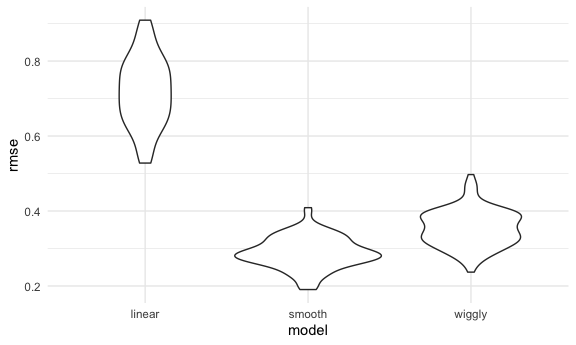

Cross Validation
================

## Simulate the data

runif (number,lower bound, upper bound)

``` r
nonlin_df = 
  tibble(
    id = 1:100,
    x = runif(100, 0, 1),
    y = 1 - 10 * (x - .3) ^ 2 + rnorm(100, 0, .3)
  )
```

Look at the data

``` r
nonlin_df %>% 
  ggplot(aes(x = x, y = y)) + 
  geom_point()
```


## Cross validation by hand

Get training and test dataset 80/20 rule anti\_join(df,not exist here)
by –arrange by id

``` r
train_df = sample_n(nonlin_df, size=80)
test_df = anti_join(nonlin_df, train_df, by = "id")
```

Fit three models

``` r
linear_mod=lm(y~x,data=train_df)
smooth_mod=gam(y~s(x),data = train_df)
wiggly_mod=gam(y~s(x,k=30),sp=10e-6,data=train_df)
```

can i see what i just did

``` r
train_df %>% 
  add_predictions(linear_mod) %>% 
  ggplot(aes(x=x,y=y))+
  geom_point()+ 
  geom_line(aes(y=pred),color="red")
```


``` r
train_df %>% 
  add_predictions(smooth_mod) %>% 
  ggplot(aes(x=x,y=y))+
  geom_point()+ 
  geom_line(aes(y=pred),color="red")
```


``` r
train_df %>% 
  add_predictions(wiggly_mod) %>% 
  ggplot(aes(x=x,y=y))+
  geom_point()+ 
  geom_line(aes(y=pred),color="red")
```


Test three models at same time

``` r
train_df %>% 
  gather_predictions(linear_mod,smooth_mod,wiggly_mod) %>% 
  ggplot(aes(x=x,y=y))+
  geom_point()+ 
  geom_line(aes(y=pred),color="red") +
  facet_grid(.~model)
```


look at prediction accuracy.

``` r
rmse(linear_mod,test_df)
```

    ## [1] 0.7052956

``` r
rmse(smooth_mod,test_df)
```

    ## [1] 0.2221774

``` r
rmse(wiggly_mod,test_df)
```

    ## [1] 0.289051

## Criss validation using `modelr`

``` r
cv_df=
  crossv_mc(nonlin_df,100)
```

waht is happening here.. crossv\_mc preforms the training / testing
split multiple times..

``` r
cv_df %>% pull(train) %>% .[[1]] %>% as.tibble()
```

    ## Warning: `as.tibble()` was deprecated in tibble 2.0.0.
    ## Please use `as_tibble()` instead.
    ## The signature and semantics have changed, see `?as_tibble`.
    ## This warning is displayed once every 8 hours.
    ## Call `lifecycle::last_lifecycle_warnings()` to see where this warning was generated.

    ## # A tibble: 79 × 3
    ##       id      x       y
    ##    <int>  <dbl>   <dbl>
    ##  1     1 0.266   1.11  
    ##  2     2 0.372   0.764 
    ##  3     3 0.573   0.358 
    ##  4     4 0.908  -3.04  
    ##  5     6 0.898  -1.99  
    ##  6     7 0.945  -3.27  
    ##  7     8 0.661  -0.615 
    ##  8     9 0.629   0.0878
    ##  9    10 0.0618  0.392 
    ## 10    11 0.206   1.63  
    ## # … with 69 more rows

``` r
cv_df %>% pull(test) %>% .[[1]] %>% as.tibble()
```

    ## # A tibble: 21 × 3
    ##       id      x      y
    ##    <int>  <dbl>  <dbl>
    ##  1     5 0.202   1.33 
    ##  2    12 0.177   0.836
    ##  3    19 0.380   0.982
    ##  4    22 0.212   0.710
    ##  5    28 0.382   0.932
    ##  6    31 0.482   0.498
    ##  7    37 0.794  -1.12 
    ##  8    42 0.647   0.158
    ##  9    47 0.0233 -0.148
    ## 10    56 0.0995  1.13 
    ## # … with 11 more rows

``` r
cv_df =cv_df %>% 
  mutate(train=map(train,as_tibble),
         test=map(test,as_tibble))
```

Let’s try to fit models and get RMSEs for them .x is new varibale
name–data from train map2 map across 2 variables

``` r
cv_df=cv_df %>% 
  mutate(linear_mod = map(.x=train,~lm(y~x,data=.x )),
         smooth_mod=map(.x=train,~gam(y~s(x),data=.x )),
         wiggly_mod=map(.x=train,~gam(y~s(x,k=30),sp=10e-6,data=.x ))) %>% 
  mutate(
    rmse_linear=map2_dbl(.x=linear_mod,.y=test, ~rmse(model=.x,data=.y)),
    rmse_smooth=map2_dbl(.x=smooth_mod,.y=test, ~rmse(model=.x,data=.y)),                       rmse_wiggly=map2_dbl(.x=wiggly_mod,.y=test, ~rmse(model=.x,data=.y)))
```

what do these results say about the model choice? fct\_inorder(): by the
order in which they first appear. fct\_infreq(): by number of
observations with each level (largest first) names\_prefix =remove the
rmse

``` r
cv_df %>% 
  select(starts_with("rmse")) %>% 
  pivot_longer(
    everything(),
    names_to = "model", 
    values_to = "rmse",
    names_prefix = "rmse_") %>% 
  mutate(model = fct_inorder(model)) %>% 
  ggplot(aes(x = model, y = rmse)) + geom_violin()
```



group\_by=control

``` r
cv_df %>% 
  select(starts_with("rmse")) %>% 
  pivot_longer(
    everything(),
    names_to = "model", 
    values_to = "rmse",
    names_prefix = "rmse_") %>% 
    group_by(model) %>% 
    summarize(avg_rmse=mean(rmse))
```

    ## # A tibble: 3 × 2
    ##   model  avg_rmse
    ##   <chr>     <dbl>
    ## 1 linear    0.718
    ## 2 smooth    0.289
    ## 3 wiggly    0.354

## Try on a real dataset

import my data

``` r
child_growth = read_csv("./nepalese_children.csv") %>% 
   mutate(weight_cp = (weight > 7) * (weight - 7))
```

    ## Rows: 2705 Columns: 5

    ## ── Column specification ────────────────────────────────────────────────────────
    ## Delimiter: ","
    ## dbl (5): age, sex, weight, height, armc

    ## 
    ## ℹ Use `spec()` to retrieve the full column specification for this data.
    ## ℹ Specify the column types or set `show_col_types = FALSE` to quiet this message.

weight vs arm circumference

``` r
child_growth %>% 
  ggplot(aes(x = weight, y = armc)) + 
  geom_point(alpha = .5)
```


``` r
linear_mod = lm(armc ~ weight, data = child_growth)
pwlin_mod  = lm(armc ~ weight + weight_cp, data = child_growth)
smooth_mod = gam(armc ~ s(weight), data = child_growth)
```

``` r
child_growth %>% 
     gather_predictions(linear_mod,pwlin_mod,smooth_mod) %>% 
    ggplot(aes(x=weight,y=armc))+
    geom_point(alpha=0.3)+ 
    geom_line(aes(y=pred),color="red") +
    facet_grid(.~model)
```


try to understand model fit by using CV

``` r
cv_df =
  crossv_mc(child_growth, 100) %>% 
  mutate(
    train = map(train, as_tibble),
    test = map(test, as_tibble))
```

``` r
cv_df = 
  cv_df %>% 
  mutate(
    linear_mod  = map(train, ~lm(armc ~ weight, data = .x)),
    pwl_mod     = map(train, ~lm(armc ~ weight + weight_cp, data = .x)),
    smooth_mod  = map(train, ~gam(armc ~ s(weight), data = as_tibble(.x)))) %>% 
  mutate(
    rmse_linear = map2_dbl(linear_mod, test, ~rmse(model = .x, data = .y)),
    rmse_pwl    = map2_dbl(pwl_mod, test, ~rmse(model = .x, data = .y)),
    rmse_smooth = map2_dbl(smooth_mod, test, ~rmse(model = .x, data = .y)))
```

pwlin is the best-not huge improvement from pwlin to smooth and huge
improvement from linear

``` r
cv_df %>% 
  select(starts_with("rmse")) %>% 
  pivot_longer(
    everything(),
    names_to = "model", 
    values_to = "rmse",
    names_prefix = "rmse_") %>% 
  mutate(model = fct_inorder(model)) %>% 
  ggplot(aes(x = model, y = rmse)) + geom_violin()
```


